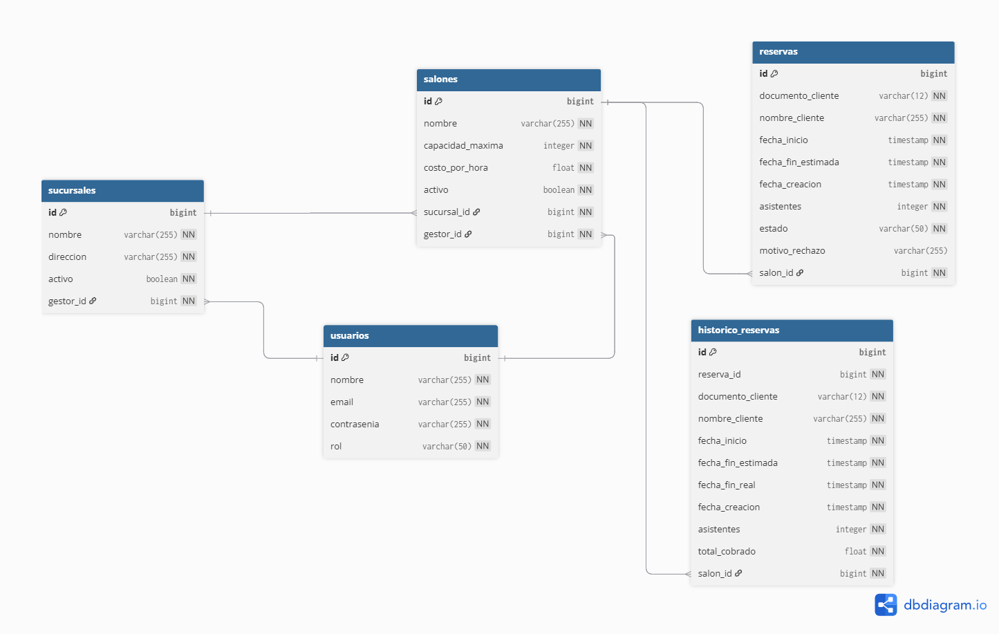

# Gestión de Reservas para Salones de Eventos

API REST para la gestión de reservas y control de ocupación de salones de eventos pertenecientes a múltiples sucursales.

## Tecnologías

- Java 17
- Spring Boot 3.5.14
- PostgreSQL 15
- Flyway
- JWT (jjwt 0.12.6)
- Swagger/OpenAPI (springdoc 2.8.6)
- Docker + Docker Compose
- Lombok

## Arquitectura

El proyecto está compuesto por dos microservicios:

- **reservas-api** (puerto 8080): API principal con toda la lógica de negocio
- **notificaciones-api** (puerto 8081): Microservicio simulado de notificaciones por correo

## Modelo Entidad-Relación



## Estructura de Paquetes

```
com.reservas.reservas_api
├── config/        ← Configuración JWT, Security, Swagger, tareas programadas
├── controller/    ← Endpoints REST
├── dto/
│   ├── request/   ← DTOs de entrada
│   └── response/  ← DTOs de salida
├── entity/        ← Entidades JPA
├── exception/     ← Excepciones personalizadas y manejador global
├── repository/    ← Interfaces JPA Repository
└── service/
    └── impl/      ← Lógica de negocio
```

## Requisitos

- Java 17
- Maven
- PostgreSQL 15 (solo para ejecución local sin Docker)
- Docker y Docker Compose (para ejecución con Docker)

## Ejecución con Docker (recomendado)

```bash
# Clonar el repositorio
git clone https://github.com/hesabeco/gestion-reservas-salones.git
cd gestion-reservas-salones

# Compilar los proyectos
cd reservas-api && ./mvnw clean package -DskipTests && cd ..
cd notificaciones-api && ./mvnw clean package -DskipTests && cd ..

# Levantar todos los servicios
docker-compose up --build
```

Esto levanta automáticamente:
- PostgreSQL en el puerto 5432
- reservas-api en el puerto 8080
- notificaciones-api en el puerto 8081

Las migraciones de Flyway se ejecutan automáticamente al arrancar, creando el esquema y los datos iniciales.

## Ejecución Local

### 1. Crear la base de datos

```sql
CREATE DATABASE reservas_db;
```

### 2. Configurar variables de entorno (opcional)

Si no se configuran, se usan los valores por defecto para desarrollo local.

```env
DB_HOST=localhost
DB_PORT=5432
DB_NAME=reservas_db
DB_USERNAME=postgres
DB_PASSWORD=postgres
JWT_SECRET=G3st10nR3s3rv4sS4l0n3s@S3cur3K3y#2026!
JWT_EXPIRATION=21600000
NOTIFICATION_SERVICE_URL=http://localhost:8081
```

### 3. Levantar el microservicio de notificaciones

```bash
cd notificaciones-api
./mvnw spring-boot:run
```

### 4. Levantar la API principal

```bash
cd reservas-api
./mvnw spring-boot:run
```

### 5. Ejecutar pruebas

```bash
cd reservas-api
./mvnw test
```

Las migraciones de Flyway se ejecutan automáticamente al arrancar.

## Datos Iniciales

Al arrancar por primera vez, Flyway inserta automáticamente:

- 1 usuario administrador
- 8 gestores (2 por sucursal)
- 4 sucursales (Bogotá, Medellín, Cali, Cúcuta)
- 16 salones distribuidos entre las sucursales
- Histórico de reservas de los últimos 6 meses para los indicadores

### Credenciales de acceso

| Usuario | Email | Contraseña | Rol |
|---|---|---|---|
| Administrador | admin@mail.com | admin | ADMIN |
| Carlos Pérez | carlos.perez@eventos.com | gestor | GESTOR |
| Ana Rodríguez | ana.rodriguez@eventos.com | gestor | GESTOR |
| Jorge Martínez | jorge.martinez@eventos.com | gestor | GESTOR |
| Laura Gómez | laura.gomez@eventos.com | gestor | GESTOR |
| Andrés Torres | andres.torres@eventos.com | gestor | GESTOR |
| Valentina Ríos | valentina.rios@eventos.com | gestor | GESTOR |
| Miguel Hernández | miguel.hernandez@eventos.com | gestor | GESTOR |
| Daniela Castro | daniela.castro@eventos.com | gestor | GESTOR |

## Documentación API

Con el proyecto corriendo, accede a Swagger UI:

```
http://localhost:8080/swagger-ui.html
```

## Colección Postman

La colección de Postman está disponible en `docs/GestionReservasSalones.postman_collection.json`.

Importarla en Postman y configurar el environment con:

| Variable | Valor |
|---|---|
| base_url | http://localhost:8080 |
| token_admin | (se llena automáticamente al hacer login) |
| token_gestor | (se llena automáticamente al hacer login) |

## Endpoints Principales

### Autenticación
| Método | Endpoint | Descripción | Rol |
|---|---|---|---|
| POST | /auth/login | Iniciar sesión | Público |
| POST | /auth/register | Registrar gestor | ADMIN |
| POST | /auth/logout | Cerrar sesión | Autenticado |

### Sucursales
| Método | Endpoint | Descripción | Rol |
|---|---|---|---|
| POST | /sucursales | Crear sucursal | ADMIN |
| GET | /sucursales | Listar sucursales | ADMIN, GESTOR |
| GET | /sucursales/{id} | Obtener sucursal | ADMIN, GESTOR |
| PUT | /sucursales/{id} | Actualizar sucursal | ADMIN |
| DELETE | /sucursales/{id} | Eliminar sucursal | ADMIN |
| PATCH | /sucursales/{id}/desactivar | Desactivar sucursal | ADMIN |

### Salones
| Método | Endpoint | Descripción | Rol |
|---|---|---|---|
| POST | /salones | Crear salón | ADMIN |
| GET | /salones | Listar salones | ADMIN, GESTOR |
| GET | /salones/{id} | Obtener salón | ADMIN, GESTOR |
| PUT | /salones/{id} | Actualizar salón | ADMIN |
| DELETE | /salones/{id} | Eliminar salón | ADMIN |
| PATCH | /salones/{id}/desactivar | Desactivar salón | ADMIN |

### Reservas
| Método | Endpoint | Descripción | Rol |
|---|---|---|---|
| POST | /reservas | Registrar reserva | GESTOR |
| POST | /reservas/finalizar | Finalizar reserva | GESTOR |
| GET | /reservas/activas/salon/{id} | Listar activas por salón | ADMIN, GESTOR |
| GET | /reservas/buscar?documento= | Buscar por documento | ADMIN, GESTOR |
| POST | /reservas/{id}/aprobar | Aprobar reserva premium | ADMIN |
| POST | /reservas/{id}/rechazar | Rechazar reserva premium | ADMIN |

### Notificaciones
| Método | Endpoint | Descripción | Rol |
|---|---|---|---|
| POST | /notificaciones | Enviar notificación | ADMIN |

### Indicadores
| Método | Endpoint | Descripción | Rol |
|---|---|---|---|
| GET | /indicadores/top10-global | Top 10 clientes global | ADMIN, GESTOR |
| GET | /indicadores/top10-salon/{id} | Top 10 clientes por salón | ADMIN, GESTOR |
| GET | /indicadores/primera-vez/{id} | Primera vez en salón | ADMIN, GESTOR |
| GET | /indicadores/ganancias/salon/{id} | Ganancias por salón | GESTOR |
| GET | /indicadores/top3-sucursales-mes | Top 3 sucursales del mes | ADMIN |

## Reglas de Negocio Destacadas

- Un cliente solo puede tener una reserva activa a la vez en todo el sistema
- Si el costo estimado supera $500.000, la reserva queda en estado `PENDIENTE_APROBACION` y requiere aprobación del ADMIN
- Las reservas con más de 48 horas en `PENDIENTE_APROBACION` expiran automáticamente
- Al aprobar una reserva premium se notifica al gestor responsable via microservicio
- No se puede reservar en un salón o sucursal inactiva
- No se puede eliminar una sucursal o salón si tiene datos asociados
- El cálculo de cobro redondea hacia arriba (fracción de hora = hora completa)
